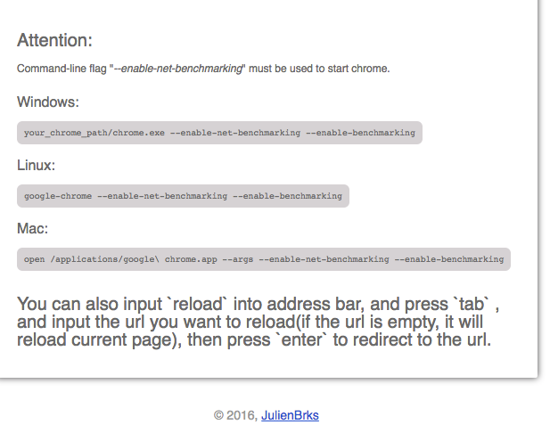

# Forked from https://github.com/swaydeng/DNS-Flusher 

This is a Chrome extenstion which helps you clearing DNS cache by one click.
By using it, you don't need to open the page(chrome://net-internals/#dns) and click the button "clear host cache" and open the page(chrome://net-internals/#sockets) and click the button "Flush socket pools" any more.

## Notice:
To use it, it requires command line flag --enable-net-benchmarking when you start the chrome browser.

See detail below:

## Source code:
https://github.com/JulienBrks/DNS-Flusher

## Install

Install from [chrome store](https://chrome.google.com/webstore/detail/dns-flusher-for-chrome/okehcbagcgnhifhcppklpmillcdnaclp)
